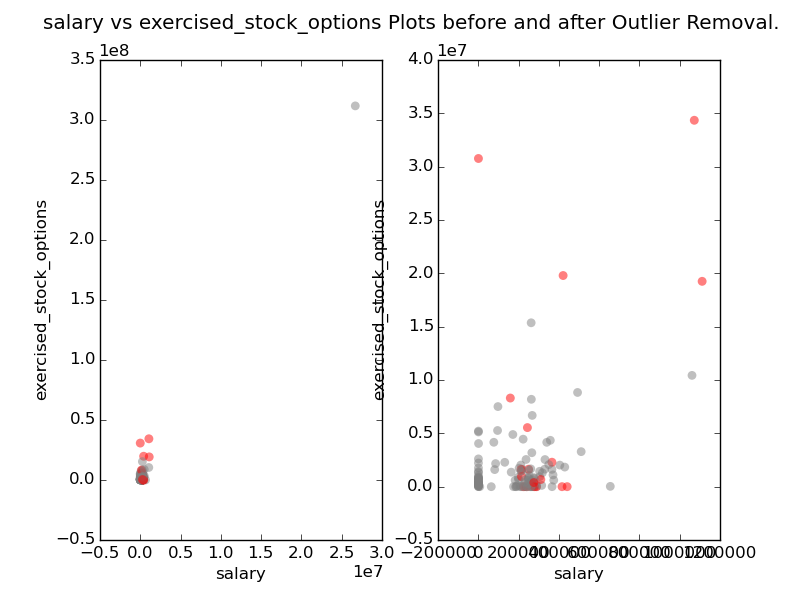

### Inroduction ###

A critical part of machine learning is making sense of your analysis
process, and communicating it to others.  The questions below will
help us understand your decision-making process and allow us to give
feedback on your project.  Please answer each question; your answers
should be 1-2 paragraphs per question.  If you find yourself writing
much more than that, take a step back and see if you can simplify your
response!

### Data ###

We want to build a classifier that can identify persons of interest in
the Enron scandal [1] from the confidential company data that was made
available to public due to Federal investigation. This includes text
data from the Enron corpus, a publicly available data set of email
messages sent or received by 150 senior managers of the Enron
Corporation, and detailed financial data for top executives. The Enron
trial has been widely covered by news paper articles [2] and other
news sources [3,4] that indicate a long list of people who
	
* were indicted (14 from Enron, 4 from Merril Lynch)
* settled without admitting guilt (total 5, 2 from Enron), or</li>
* testified for government in exchange for immunity (8 from Enron). </li>

Any Enron employee from the above list is a person of interest
(POI). A hand-generated list of POIs, combined with the email and
financial data was given to us in pickle data format as a starting
point of our detective work.

After loading the pickle data into a Python dictionary, and early
exploration of the data reveals (code available in poi_id.py)

* Enron data set includes 146 people
* 21 features are collected on each person
* only 18 people in the data set are marked as POIs

The data set only has 146 examples, and contains only 18 out of 30 or
so POIs. Although fairly small, the data set contains several missing
entries that are denoted as 'NaN'. Do POIs have fewer or more NaNs ?
For each feature, we compared the percentage of missing entries among
POIs and non-POIs and looked for any difference over 30%. The
following features showed a large difference in percentage of missing
entries
	
* expenses (POIs all known, non-POIs 40% unknown)
* email_address (POIs all known, non-POIs 27% unknown)
* total_stock_value (POIs all known, non-POIs 39% unknown)
* total_payments (POIs all known, non-POIs 16% unknown)
* salary (POIs 5.55% unknown, non-POIs 15% unknown)
* bonus (POIs 11% unknown, non-POIs 48% unknown)

It is not surprising that more financial information is available on
the 18 POIs than on the 128 non POIs. However, we should be careful
about using features that have a large percentage of unknown entries.

Besides emails, we also want to explore the amount of money people
were making. A scatter plot of salaries and bonuses, shown below,
indicates an outlier. A closer look at the financial document table
reveals that the outlier data point comes from a row called "TOTAL"
which, instead of representing a real person, simply adds up all other
examples. Such an outlier should clearly be ignored. After dropping
this example from the data, we can still see some outliers that
correspond to extraorniary income by some individuals (eg. Ken Lay and
Jack Skilling). Insread of rejecting, we need pay closer attention to
these outliers for clues to POI patterns.

### Features ###

What features did you end up using in your POI identifier, and what
selection process did you use to pick them?  Did you have to do any
scaling?  Why or why not?  As part of the assignment, you should
attempt to engineer your own feature that doesn’t come ready-made in
the dataset--explain what feature you tried to make, and the rationale
behind it.  (You do not necessarily have to use it in the final
analysis, only engineer and test it.)  If you used an algorithm like a
decision tree, please also give the feature importances of the
features that you use.  [relevant rubric items: “create new features”,
“properly scale features”, “intelligently select feature”]

Even though we don't really know what causes a person to be a POI or
not, Enron's tale of corporate greed is widely known. Hence we can
intuitively include the key features associated with financial gain;
e.g. salary, bonus, and exercised_stock_options. This intuition has
also been validated during our outlier investigation, where we noted
that people with extremely high salary and exercised_stock_options are
often POIs. However for feature selction, we would like to follow an
exhaustive, robust and scientific methodology devoid of any room for
intuition. In particular, we want to arrive at the simplest, but no
simpler, set of features as follows:
	
1. add new features to expose hidden patterns (make it no simpler)
2. select the best features by getting rid of stuff that does not help
	  (make it as simple as possible)

We start by adding new features to draw out as many patterns in the
data as possible. From scatter plots we can see that often POIs
themselves are the senders (resp. recipients) of the largest number of
emails to (resp. from) other POIs. The only exception is Enron's
previous CEO, LAVORATO JOHN J, who recieved the largest number of
emails from POIs, but himself is not a POI. Therefore we add a new
feature called "with_poi" which adds the two features
"from_poi_to_this_person", and "from_this_person_to_poi". This
combined feature, which is expected to give a stronger discriminating
power, improves the precision and recall metrics of the Decison Tree
and the AdaBoost classifiers, even though it does not improve the
performance of the KNN classifier that we eventually selected. Here is
a table showing the effect of the new "with_poi" feature on the
precision and recall metrics of several different classifiers.

  <table class="answer">
	<tr>
	  <th rowspan="2">Algorithm</th>
	  <th colspan="2">Original Features</th>
	  <th colspan="2">Additional "with-poi" Feature</th>
	</tr>
	<tr>
	  <th>Precision</th>
	  <th>Recall</th>
	  <th>Precision</th>
	  <th>Recall</th>
	</tr>
	<tr>
	  <td>K-Nearest Neighbor</td>
	  <td>0.74951</td>
	  <td>0.38450</td>
	  <td>0.74948</td>
	  <td>0.36050</td>
	</tr>
	<tr>
	  <td>Decison Tree</td>
	  <td>0.37287</td>
	  <td>0.29550</td>
	  <td>0.42115</td>
	  <td>0.33250</td>
	</tr>
	<tr>
	  <td>Gaussian Naive Bayes</td>
	  <td>0.48281</td>
	  <td>0.30900</td>
	  <td>0.42308</td>
	  <td>0.33550</td>
	</tr>
	<tr>
	  <td>Random Forest</td>
	  <td>0.54555</td>
	  <td>0.26050</td>
	  <td>0.45289</td>
	  <td>0.21150</td>
	</tr>
	<tr>
	  <td>AdaBoost</td>
	  <td>0.37516</td>
	  <td>0.30200</td>
	  <td>0.41307</td>
	  <td>0.30650</td>
	</tr>
  </table>

After adding "with_poi", and removing a text feature called
"email_address", we end up with effectively 20 features. How do we
know which features indicate a "poi" ? We start with measuring the
importance each individual feature with the Decision Tree
classifier. In this context, the importance of a feature defined as
the reduction of the impurity criterion brought by that
feature. Features with higher importance are likely to have higher
discriminating power. This is shown in the following table.

  <table class="answer">
    <tr>
      <th>Feature</th>
      <th>Importance</th>
    </tr>
    <tr>
      <td> exercised_stock_options </td>
      <td> 0.200 </td>
    </tr>
    <tr>
      <td> expenses </td>
      <td> 0.174 </td>
    </tr>
    <tr>
      <td> bonus </td>
      <td> 0.162 </td>
    </tr>
    <tr>
      <td> restricted_stock </td>
      <td> 0.120 </td>
    </tr>
    <tr>
      <td> total_payments </td>
      <td> 0.113 </td>
    </tr>
    <tr>
      <td> from_messages </td>
      <td> 0.087 </td>
    </tr>
    <tr>
      <td> from_this_person_to_poi </td>
      <td> 0.065 </td>
    </tr>
    <tr>
      <td> shared_receipt_with_poi </td>
      <td> 0.048 </td>
    </tr>
    <tr>
      <td> other </td>
      <td> 0.030 </td>
    </tr>
    <tr>
      <td> to_messages </td>
      <td> 0.000 </td>
    </tr>
    <tr>
      <td> with_poi </td>
      <td> 0.000 </td>
    </tr>
    <tr>
      <td> deferral_payments </td>
      <td> 0.000 </td>
    </tr>
    <tr>
      <td> total_stock_value </td>
      <td> 0.000 </td>
    </tr>
    <tr>
      <td> from_poi_to_this_person </td>
      <td> 0.000 </td>
    </tr>
    <tr>
      <td> deferred_income </td>
      <td> 0.000 </td>
    </tr>
    <tr>
      <td> long_term_incentive </td>
      <td> 0.000 </td>
    </tr>
    <tr>
      <td> salary </td>
      <td> 0.000 </td>
    </tr>
    <tr>
      <td> loan_advances </td>
      <td> 0.000 </td>
    </tr>
    <tr>
      <td> restricted_stock_deferred </td>
      <td> 0.000 </td>
    </tr>
    <tr>
      <td> director_fees </td>
      <td> 0.000 </td>
    </tr>
  </table>

In the next step we select the minimum set of features that give the
most power in classifying. Of multiple feature selection techniques
available out there, we chose univariate feature selection, which
selects the best features based on the ANOVA F-value of the
samples. The SelectKBest utility from Sklearn was used for different
values of k, and the selected set of features were tested with two
different classifiers, KNN and Decision Tree. Before using the KNN
classifier, we used the Minmax scaler to scale the features.  
 
 The results from each of these classifiers also depend
on the parameter tunes: we used the default KNeighborsClassifier()
classifier from sklearn, and a hand-tuned Decision Tree classifier
with parameters min_samples_split=5, min_samples_leaf=2. The results
are summarized in the following table. We also handpicked a set of
features based on intuition and brute search, which is reported at the
last row of the table. For each classifier, the best combination of
precision and recall values is highlighted.  

  <table class="answer">
    <tr>
      <th rowspan="3">Selector</th>
      <th colspan="6">Classifier</th>
    </tr>
    <tr>
      <th colspan="3">KNN</th>
      <th colspan="3">Decision Tree</th>
    </tr>
    <tr>
      <th>Precision</th>
      <th>Recall</th>
      <th>F1</th>
      <th>Precision</th>
      <th>Recall</th>
      <th>F1</th>
    </tr>
    
    <tr>
      <td> 2 Best </td>
      <td>0.695</td>
      <td>0.204</td>
      <td>0.315</td>
      <td>0.369</td>
      <td>0.206</td>
      <td>0.265</td>
    </tr>
    <tr>
      <td> 3 Best </td>
      <td bgcolor="#00CC66">0.797</td>
      <td bgcolor="#00CC66">0.277</td>
      <td bgcolor="#00CC66">0.411</td>
      <td>0.371</td>
      <td>0.273</td>
      <td>0.315</td>
    </tr>
    <tr>
      <td> 4 Best </td>
      <td>0.435</td>
      <td>0.042</td>
      <td>0.076</td>
      <td>0.352</td>
      <td>0.261</td>
      <td>0.300</td>
    </tr>
    <tr>
      <td> 5 Best </td>
      <td>0.437</td>
      <td>0.098</td>
      <td>0.159</td>
      <td>0.273</td>
      <td>0.184</td>
      <td>0.220</td>
    </tr>
    <tr>
      <td> 6 Best </td>
      <td>0.249</td>
      <td>0.029</td>
      <td>0.051</td>
      <td>0.295</td>
      <td>0.203</td>
      <td>0.241</td>
    </tr>
    <tr>
      <td> 7 Best </td>
      <td>0.143</td>
      <td>0.015</td>
      <td>0.027</td>
      <td>0.298</td>
      <td>0.223</td>
      <td>0.255</td>
    </tr>
    <tr>
      <td> 8 Best </td>
      <td>0.158</td>
      <td>0.017</td>
      <td>0.030</td>
      <td>0.304</td>
      <td>0.225</td>
      <td>0.259</td>
    </tr>
    <tr>
      <td> 9 Best </td>
      <td>0.002</td>
      <td>0.001</td>
      <td>0.001</td>
      <td>0.299</td>
      <td>0.248</td>
      <td>0.271</td>
    </tr>
    <tr>
      <td> 10 Best </td>
      <td>0.002</td>
      <td>0.001</td>
      <td>0.001</td>
      <td>0.305</td>
      <td>0.248</td>
      <td>0.274</td>
    </tr>
    <tr>
      <td> 11 Best </td>
      <td>0.206</td>
      <td>0.052</td>
      <td>0.083</td>
      <td>0.289</td>
      <td>0.247</td>
      <td>0.266</td>
    </tr>
    <tr>
      <td> 12 Best </td>
      <td>0.125</td>
      <td>0.013</td>
      <td>0.024</td>
      <td>0.290</td>
      <td>0.245</td>
      <td>0.266</td>
    </tr>
    <tr>
      <td> 13 Best </td>
      <td>0.000</td>
      <td>0.000</td>
      <td>0.000</td>
      <td>0.274</td>
      <td>0.239</td>
      <td>0.255</td>
    </tr>
    <tr>
      <td> 14 Best </td>
      <td>0.000</td>
      <td>0.000</td>
      <td>0.000</td>
      <td>0.232</td>
      <td>0.179</td>
      <td>0.202</td>
    </tr>
    <tr>
      <td> Manual </td>
      <td>0.010</td>
      <td>0.002</td>
      <td>0.003</td>
      <td bgcolor="#00CC66">0.426</td>
      <td bgcolor="#00CC66">0.337</td>
      <td bgcolor="#00CC66">0.376</td>
    </tr>
  </table>

For the kNN classifiers, SelectKBest with K=3 produced the best F1
score (which is the harmonic mean of precision and recall). These 3
features are: 'bonus', 'total_stock_value', and
'exercised_stock_options'. However, for the hand-tuned Decision Tree
classifier, the manually selected featuers 'salary', 'bonus',
'exercised_stock_options', and 'with_poi', outperformed the best
features selected by the SelectKBest utility.

As observed above, feature selection schemes perform differently on
different classifiers. Even on the same classifier, the performance of
a scheme may vary with different parameter tunings.  Additionally a
different feature selection utility, e.g. Chi-square, or Recursive
Feature Elimination (RFE) may also lead to a different set of features
getting selected. In the interest of time these experiments are left
as future work.

Feature scaling is an important aspect of certain classification
algorithms that trade off one feature against another. As discussed in
the next section, we found that the K-Nearest_Neighbor classifier gave
the best precision and recall numbers. KNN's Euclidean distance metric
is affected by feature scaling. So we performed MinMax scaling before
fitting the KNN classifier. This makes a noticeable difference in
KNN's performance numbers.

### Algorithm ###

What algorithm did you end up using?  What other one(s) did you
try? [relevant rubric item: “pick an algorithm”]

The K-Nearest Neighbors (KNN) classifier outperformed all other
classifiers by a wide margin. I achieved a precision of 0.72 which is
almost twice as good as any other classifier that we attempted.
	
The second best performer was the Decision Tree
classifier. Performance number of both the classifiers are given in
the following table. The new feature "with_poi", described above,
helped improve the precision and recall scores of the Decision Tree
classifier.

Several other classifiers, including NaiveBayes, AdaBoost,
and RandomForest, were also attempted.

The following table summarizes the performance numbers of all the
classifiers. For each kind, the default classifiers provided by the
sklearn package was used. Later the parameters of best two
classifiers, KNN and Decision Tree were tuned for improved
performance, as described in the next section.
	
  

  <table class="answer">
    <tr>
      <th>Classifier</th>
      <th>Accuracy</th>
      <th>Precision</th>
      <th>Recall</th>
      <th>F1-score</th>
      <th>F2-score</th>
    </tr>
    
    <tr>
      <td> kNN </td>
      <td bgcolor="#00CC66">0.878</td>
      <td bgcolor="#00CC66">0.797</td>
      <td bgcolor="#00CC66">0.277</td>
      <td bgcolor="#00CC66">0.411</td>
      <td bgcolor="#00CC66">0.318</td>
    </tr>
    <tr>
      <td> Decision Tree </td>
      <td>0.800</td>
      <td>0.355</td>
      <td>0.363</td>
      <td>0.359</td>
      <td>0.362</td>
    </tr>
    <tr>
      <td> Naive Bayes </td>
      <td>0.831</td>
      <td>0.430</td>
      <td>0.292</td>
      <td>0.348</td>
      <td>0.312</td>
    </tr>
    <tr>
      <td> Random Forest </td>
      <td>0.839</td>
      <td>0.450</td>
      <td>0.214</td>
      <td>0.290</td>
      <td>0.239</td>
    </tr>
    <tr>
      <td> AdaBoost </td>
      <td>0.826</td>
      <td>0.414</td>
      <td>0.307</td>
      <td>0.353</td>
      <td>0.324</td>
    </tr>
  </table>
  

### Parameter Tuning ###

What does it mean to tune the parameters of an algorithm, and what can
happen if you don’t do this well?  How did you tune the parameters of
your particular algorithm?  (Some algorithms don’t have parameters
that you need to tune--if this is the case for the one you picked,
identify and briefly explain how you would have done it if you used,
say, a decision tree classifier). [relevant rubric item: “tune the
algorithm”]

Parameters are arguments passed when creating a classifier, and before
fitting. Parameters can make a huge difference in the decision
boundary that the classification algorithm arrives at. Sometimes
parameter tuning can cause overfitting, and chosing the right
parameters which avoiding overfitting is an art.

GridSearchCV was used to systematically tune the parameters of the
two best-performing classifiers KNN, and Decision Tree. These
results are summarized in the table below. In addition to grid
search through possible parameters, the table also shows results
of hand-tuning the KNN and Decision Tree classifiers based on our
understanding of the classification algorithms. It is interesting
to note the hand-tuned Decision Tree slightly outperforms the
grid-searched Decision Tree.
	
Following observations were made during hand-tuning of KNN classifier

1. Parameter p=1 (use Manhattan distance instead of Euclidean) did
		actually help, and improved both the precision and recall
		scores. Hence we used p=1 in our final classifier.

2. Parameter leaf_size was varied from 5 to 100 (default=30), but
 it had no significant effect.

For the Decision Tree Classifier we tried the following parameter
tunes

1. splitter="random" (default="best") degraded the performance.
2. min_samples_split=5 (default=2) improved the precision but degraded recall.
3. default parameter values gave the best balance between precision and recall. 

  <table class="answer">
    <tr>
      <th>Tuned Classifier</th>
      <th>Accuracy</th>
      <th>Precision</th>
      <th>Recall</th>
      <th>F1-score</th>
      <th>F2-score</th>
      <th>Tuned params</th>
    </tr>
    
    <tr>
      <td> kNN (grid-tuned) </td>
      <td bgcolor="#00CC66">0.893</td>
      <td bgcolor="#00CC66">0.868</td>
      <td bgcolor="#00CC66">0.362</td>
      <td bgcolor="#00CC66">0.511</td>
      <td bgcolor="#00CC66">0.410</td>
      <td bgcolor="#00CC66">{'n_neighbors': 5, 'leaf_size': 30, 'p': 1}</td>
    </tr>
    <tr>
      <td> kNN (hand-tuned) </td>
      <td>0.821</td>
      <td>0.166</td>
      <td>0.041</td>
      <td>0.066</td>
      <td>0.048</td>
      <td>{'n_neighbors': 5, 'leaf_size': 30, 'p': 1}</td>
    </tr>
    <tr>
      <td> Decision Tree (hand-tuned) </td>
      <td>0.827</td>
      <td>0.423</td>
      <td>0.334</td>
      <td>0.373</td>
      <td>0.348</td>
      <td>{'min_samples_split': 3, 'splitter': 'best', 'min_samples_leaf': 2}</td>
    </tr>
    <tr>
      <td> Decision Tree (grid-tuned) </td>
      <td>0.828</td>
      <td>0.422</td>
      <td>0.327</td>
      <td>0.368</td>
      <td>0.342</td>
      <td>{'min_samples_split': 3, 'splitter': 'best', 'min_samples_leaf': 2}</td>
    </tr>
  </table>

### Validation ###

What is validation, and what’s a classic mistake you can make if
you do it wrong?  How did you validate your analysis?  [relevant
	rubric item: “validation strategy”]

Validation gives an estimate of performance on an independent data
set. Validation provides counter balance to over fitting. Without
	validation, it is hard to know when to stop tuning the classifier
	over training data.

It is common practice to split data into training and test sets,
and to use test data for validation. This presents a dilemma
	because setting aside test data can adversely affect the extent of
	training of the classifier. Splitting the limited amount of data
	that we have available on only 146 Enron employees, would make it
	hard to train and test any classifier. Hence we an alternative
	technique called cross validation to use the limited amount of
	data for both training and testing.

A particular type of cross-validation method called
 StratifiedShuffleSplit was used instead of simpler
    cross-validation method such as TrainTestSplit.
    StratifiedShuffleSplit creates random training and test sets
    multiple times and averages the results over all the tests.

The class distribution of the POIs and non-POIs are heavily skewed
at 18 to 128. In such cases, StratifidShuffleSplit tries to
    maintain the same non-POI:POI ratio in all training and test sets
    that it creates from the larger data set. Instead of accuracy
    scores, we used precision, recall, and F1 scores to mitigate the
    effect of skewed distribution of POIs and non-POIs and validate
    the results.

### Metrics ###

Give at least 2 evaluation metrics, and your average performance for
each of them.  Explain an interpretation of your metrics that says
something human-understandable about your algorithm’s
performance. [relevant rubric item: “usage of evaluation metrics”]

The KNN classifier with parameters p=1, n_neighbors=5, leaf_size=30
achieved a precision score of 0.868, a recall score of 0.362, and an
F1-score (harmonic mean of precision and recall) of 0.511. It also
achieves an accuracy score of 0.89, even though accuracy score is not
an ideal metric in this case.

The precision score of 0.868 implies that once the classifier has
called out an employee POI, there is 87% chance that the employee is
really a POI. On the other hand, a recall score of 0.362 implies that
give an actual POI, there is 36% chance that the classifier will be
able to call him out.

### References ###

  
[1] <a href="https://en.wikipedia.org/wiki/Enron_scandal">Enron Scandal</a>

  
[2] <a href="http://usatoday30.usatoday.com/money/industries/energy/2005-12-28-enron-participants_x.htm">A look at those involved in the Enron Scandal</a>

  
[3] <a href="http://money.cnn.com/2004/01/14/news/companies/enron_scorecard/index.htm">Enron scorecard</a>

  
[4] <a href="http://www.pbs.org/independentlens/enron/film.html">Enron:
  The Smartest Guys in the Room, PBS Independent Lens</a>

  
[4] <a href="http://www.cs.cmu.edu/~enron/">Enron Email Corpus hosted by CMU</a>

  
[5] <a href="http://www.cs.cmu.edu/~enron/">Nearest Neighbors</a>

</body>
</html> 

